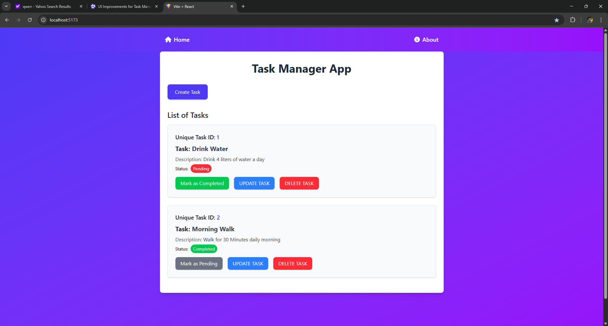
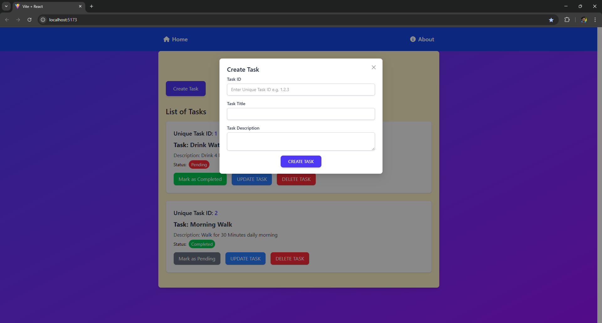
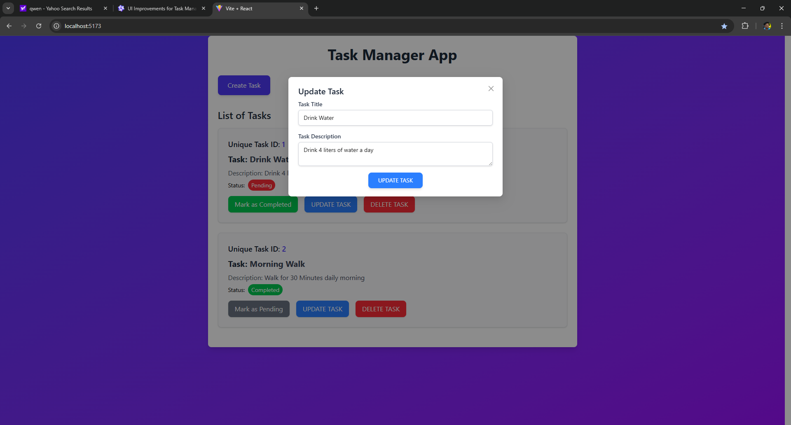
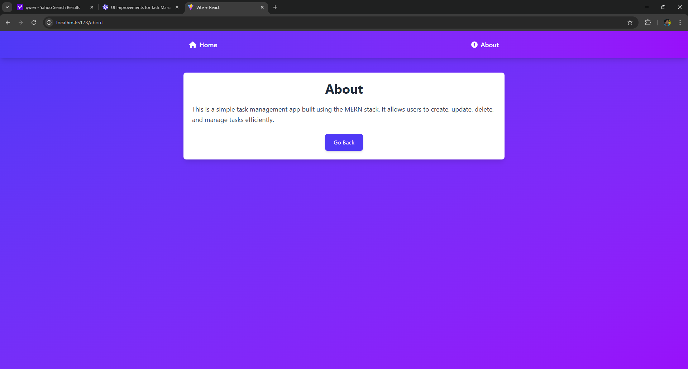

A full-stack Task Manager application built using the MERN stack (MongoDB, Express.js, React, Node.js). It enables users to manage tasks efficiently with features like create Task, view task, and status tracking.
Installation : Clone the repository make sure you have React and Node latest version installed, install the dependencies mentioned in package.json uploaded.
Setup : 1. Setup the server using node or nodemon, in vs code terminal type cd server then start the server.
        2. Setup the frontend using React Vite, start another vs code terminal then type npm run dev.
APIs : Post Tasks API = /api/v1/tasks/create
       Get All Task API = /api/v1/tasks/getAllTasks
       Get/Update/Delete Task by Id = /api/v1/tasks/:id
Steps to Check API in Postman :
       1. Post API - URL = http://localhost:8000/api/v1/tasks/create 
          then select method post in body send raw data like this {"uid":"23a","title":"run","description":"running"}
       2. Get All Task API - URL = http://localhost:8000/api/v1/tasks/getAllTasks
          then select method get and send response you will get data.
        3. Update/Delete API - URL = http://localhost:8000/api/v1/tasks/:id
            replace the :id with id of exsisting task
            i. To update select method put then in body send raw data like this {"title":"jump","description":"jump1"} your data will be updated and you wil get a success message.
            ii. To delete select method delete then send request.
            
Screenshots = Home page :  
              Create Task : 
              Update Task :  
              About Page :  
